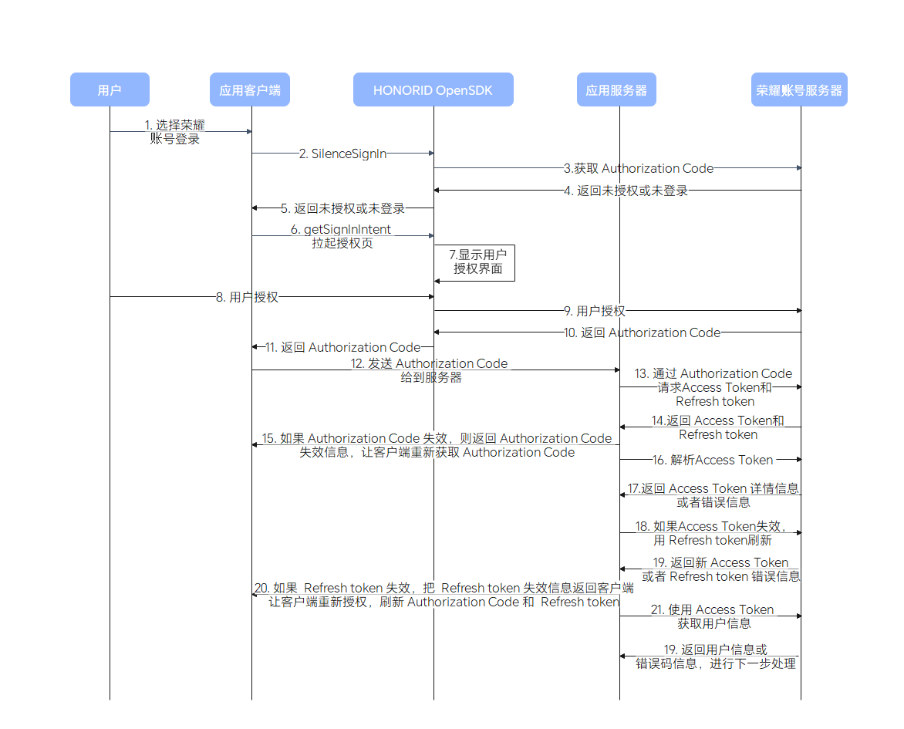

# Honor Account Example Code

## directory

[TOC]

## Introduction

```
Convenient to understand the authorized login of Honor account, we provide Honor account sample program for your reference or use. Honor account examples include Android Java sample code and server REST sample code, mainly introducing how Honor account performs various authorized login and server interface parsing. Android Java sample code implements silent login, authorized login, cancel login, and incremental authorization functions, The REST example code of the service mainly parses the main methods and parameter transmission and response of the interface.
```

## Interface Description

Android

| Package Name                                                 | Description                                                  |
| ------------------------------------------------------------ | ------------------------------------------------------------ |
| [com.hihonor.cloudservice.support.account](https://developer.honor.com/cn/kitdoc?category=基础服务&kitId=11001&navigation=ref&docId=com.hihonor.cloudservice.support.account/HonorIdSignInManager.md) | Provide account login authorization service interface        |
| [com.hihonor.cloudservice.support.account.service](https://developer.honor.com/cn/kitdoc?category=基础服务&kitId=11001&navigation=ref&docId=com.hihonor.cloudservice.support.account.service/HonorIDSignInService.md) | Including silent login, authorization cancellation, and obtainingSignInIntent |
| [com.hihonor.cloudservice.support.account.request](https://developer.honor.com/cn/kitdoc?category=基础服务&kitId=11001&navigation=ref&docId=com.hihonor.cloudservice.support.account.request/SignInOptions.md) | Account login authorization service request object           |
| [com.hihonor.cloudservice.support.account.result](https://developer.honor.com/cn/kitdoc?category=基础服务&kitId=11001&navigation=ref&docId=com.hihonor.cloudservice.support.account.result/SignInAccountInfo.md) | Login class containing account services                      |

Server

| CLASS                                      | Implement interfaces             | describe                             |
| ------------------------------------------ | -------------------------------- | ------------------------------------ |
| com.hihonor.honorid.demo.AtParserDemo      | hihonor.oauth2.user.getTokenInfo | analysis Access Token                |
| com.hihonor.honorid.demo.Code2AtDemo       | /oauth2/v3/token                 | Code change Access Token             |
| com.hihonor.honorid.demo.GetInfoDemo       | GOpen.User.getInfo               | Access Token Obtain user information |
| com.hihonor.honorid.demo.GetServerAtDemo   | /oauth2/v3/token                 | Get application level Access Token   |
| com.hihonor.honorid.demo.IDTokenParserDemo | -                                | Local parsing ID Token               |
| com.hihonor.honorid.demo.Rt2AtDemo         | /oauth2/v3/token                 | Refresh Token refresh Access Token   |

## Flow chart

