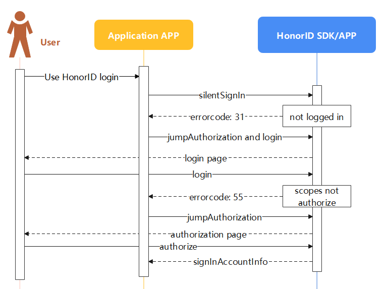

# Honor ID Android Java Sample Code

[中文](README.md)|English

## Contents

- [Introduction](#Introduction)
- [Environment](#Environment)
- [Preparation](#Preparation)
- [Running Results](#Running Results)

- [License](#License)

## Introduction

The Honor ID Android Java Sample Code encapsulates the client interface of the Honor ID Service and provides an example that implements: silent sign in, authorize login, cancel authorization, and incremental authorization. For details, you can also refer to: [Integrating HonorID OpenSDK](https://developer.honor.com/cn/kitdoc?category=%E5%9F%BA%E7%A1%80%E6%9C%8D%E5%8A% A1&kitId=11001&navigation=guides&docId=android-intergrate-sdk.md&token=)

## Environment

[JDK](https://www.oracle.com/java/technologies/javase-downloads.html)  1.8 and above

-Install [Android Studio]( https://developer.android.com/studio)3.6.1 and above

-MinSdkVersion 19 and above

-TargetSdkVersion 31 (recommended)

-CompileSdkVersion 31 (recommended)

-Gradle 5.4.1 and above (recommended)

-Equipment for testing applications: MagicUI 4.0 and above Honor phones.

-Honor account APK 6.0.2.300 and above

## Preparation

1. Open the sample code project in Android Studio and run the test application on the device or emulator where you have installed the latest version of the Honor Account APP.

2. Register for [Honor Developer Account](https://developer.honor.com/cn/ ).

3. Create an Android application. For details, please refer to [Development Preparation | Applying for Android Applications](https://developer.honor.com/cn/kitdoc?category=base&kitId=11001&navigation=guides&docId=android-apply-application.md).

Before building this sample demo, please import it into Android Studio (version 3.6.1 and above).

5. Configuration example code:

(1) Replace the "applicationid" in the "build. gradle" file in the example project with your own application package name.

(2) Replace the mClientID parameter in the sample project with your AppID.

6. Run your application on an Android device or emulator.

## Running Results

The example demo page is shown below:

1. Silent login.

When the application calls the silent login interface again and returns error 31 (not logged in) or error 55 (scopes not authorize), the authorization page interface is called and the authorization page is pulled up; After the user logs in and authorizes, they can obtain the authorization code. Calling silent login again can return the user's authorization code, openId, unionId, and ID Token, where ID Token can be used for ID Token mode login.

2. Authorization page, authorization code mode, login page display.

3. Cancel authorization.

4. Add authorization.

## License

Authorized License Honor ID Service Android Sample Code passed through [Apache License 2.0](http://www.apache.org/licenses/LICENSE-2.0 ) Authorization License.