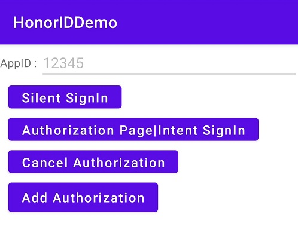

# 荣耀账号安卓端Java示例代码

中文 | [English](README.md) 

## 目录

* [简介](#简介)
* [环境要求](#环境要求)
* [开发准备](#开发准备)
* [运行结果](#运行结果)
* [授权许可](#授权许可)

## 简介

荣耀账号安卓端Java示例代码对荣耀账号服务(HonorID) 的客户端接口进行封装而提供的示例，实现了：静默登录, 授权登录, 取消授权, 增量授权功能。具体也可以参考：[集成HonorID OpenSDK](https://developer.honor.com/cn/kitdoc?category=%E5%9F%BA%E7%A1%80%E6%9C%8D%E5%8A%A1&kitId=11001&navigation=guides&docId=android-intergrate-sdk.md&token=)。

## 环境要求

- [JDK](https://www.oracle.com/java/technologies/javase-downloads.html) 1.8及以上
- 安装[Android Studio](https://developer.android.com/studio) 3.6.1及以上

  - minSdkVersion 19及以上
  - targetSdkVersion 31（推荐）
  - compileSdkVersion 31（推荐）
  - Gradle 5.4.1及以上（推荐）
- 测试应用的设备：MagicUI 4.0及以上的荣耀手机。
- 荣耀账号APK 6.0.2.300及以上

## 开发准备

1. 在Android Studio中打开示例代码工程，并在您已安装最新版荣耀账号APP的设备或模拟器上运行测试应用。
2. 注册[荣耀开发者账号](https://developer.honor.com/cn/)。
3. 创建安卓应用。具体请参考[开发准备|申请安卓应用](https://developer.honor.com/cn/kitdoc?category=base&kitId=11001&navigation=guides&docId=android-apply-application.md)。
4. 构建此示例demo前，请先将demo导入Android Studio（3.6.1及以上版本）。
5. 配置示例代码：
     （1）将示例工程中“build.gradle”文件中的“applicationid”替换为您自己的应用包名。
     （2）将示例工程中的 mClientID 参数替换为您的AppID。
6. 在Android设备或模拟器上运行您的应用。

## 运行结果

示例demo页面展示如下：

本示例代码提供了以下使用场景：

1. 静默登录。

   应用再调用静默登录接口时，如果返回错误31(not logged in) 或者 错误55(scopes not authorize), 则 调用授权页面接口，拉起授权页；用户登录并授权之后，可以获取到授权码。再次调用静默登录可以返回 用户的授权码, openId, unionId, ID Token，其中ID Token 可以用于ID Token 模式登录。 

2. 授权页面，授权码模式，前台显示登录。
3. 取消授权。
4. 新增授权。

## 授权许可
荣耀账号服务Android示例代码经过[Apache License 2.0](http://www.apache.org/licenses/LICENSE-2.0)授权许可。
